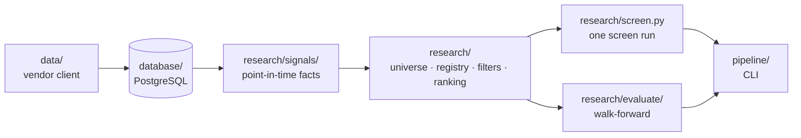

# Sharadar Toolkit

Point-in-time equity research over Nasdaq Data Link's Sharadar datasets. It
loads Sharadar's price, fundamental, corporate-event, insider and institutional
data into PostgreSQL, derives point-in-time facts from it, and screens the
market on any historical date using only the information available on that date.
Screens are defined as data, run from the command line, and can be measured
against a benchmark across a series of past dates.

## What makes it different

- **Point-in-time correctness.** A 13F is held back 45 days for its filing lag,
  insider windows are measured on filing date rather than trade date, and an
  8-K filed on the signal day is invisible to a screen run that day.
- **Missing stays missing.** A loss-maker has no P/E, and it is never zero-filled
  into looking cheap. A NaN survives to the filter that would have used it.
- **Every result explains itself.** Each run reports the funnel — how many names
  each condition removed, and how many of those went for missing data rather
  than a failed test.

The reasoning behind these, and the decisions that cost real time to settle,
live in [.claude/CONTEXT.md](.claude/CONTEXT.md).

## Requirements

- Python 3.14 and [uv](https://docs.astral.sh/uv/)
- PostgreSQL
- A Sharadar subscription covering **SEP, SFP, SF1, SF2, SF3A, DAILY, EVENTS,
  TICKERS**. A partial subscription fails partway through the load.

## Setup

```bash
uv sync
```

Create `.env` in the project root:

```
NDL_APIKEY=your_nasdaq_data_link_key
DB_USER=postgres
DB_PASSWORD=your_password
DB_HOST=localhost
DB_PORT=5432
DB_NAME=sharadar
```

Then create the tables and fill them:

```bash
uv run python -m pipeline.main setup    # drops and recreates every table
uv run python -m pipeline.main load     # bulk-loads from the vendor
```

The full load takes a few hours and lands about 15 GB. It is resumable per
dataset: a failed dataset is reported and the rest still run, so
`load institutional` picks up whatever fell over without repeating the rest.

## What gets loaded

| dataset | source | grain |
|---|---|---|
| `equity_prices` | SEP | ticker × session |
| `technical_features` | *computed locally* | ticker × session |
| `daily_valuation` | DAILY | ticker × session |
| `fund_prices` | SFP | fund × session |
| `insider_transactions` | SF2 | Form 4 line |
| `fundamentals` | SF1 | ticker × dimension × filing |
| `events` | EVENTS | ticker × date |
| `institutional_ownership` | SF3A | ticker × quarter |
| `tickers` | TICKERS | ticker × vendor table |


## Keeping it current

```bash
uv run python -m pipeline.main update              # every dataset
uv run python -m pipeline.main update institutional # or just one
```

Most steps resume from a stored watermark. Insider filings, events, and 13F
holdings use a fixed lookback instead, because those records can appear long
after the date they describe. Technical features run last and recompute any
ticker whose price history was re-adjusted, since a split rewrites the whole
series in place.

## Running a screen

```bash
uv run python -m pipeline.main screen quality_at_a_price
```

```
quality_at_a_price · as of 2026-08-20
  Profitable large caps in an uptrend, best-scoring per sector.
  structural universe 5,297 -> 33 selected

FUNNEL
                         condition  before  after  dropped  dropped_for_null
          scored (coverage >= 0.5)    5297   3323     1974              1974
        marketcap >= 10000000000.0    3323    884     2439                 0
dollar_volume_20d_avg >= 5000000.0     884    883        1                 0
                  netinccmnusd > 0     883    824       59                 0
              pct_from_sma_200 > 0     824    575      249                 5

SELECTED
ticker                 sector score  rank coverage
   KGC        Basic Materials  91.8   1.0     100%
   IAG        Basic Materials  89.7   2.0     100%
   SIRI Communication Services  68.2   1.0     100%
   ...
```

`--as-of 2024-03-15` reconstructs that date instead, resolving to the latest
session on or before it and reporting which. A date the loaded calendar cannot
cover is rejected, never quietly moved forward. `--out results.csv` writes the
selections with every signal value behind them; `--out results.json` adds the
run's own context, so a stored result is readable without the spec that made it.

## Measuring whether a screen works

```bash
uv run python -m pipeline.main evaluate quality_at_a_price deep_value \
    --from 2018-01-01 --horizon 63
```

Each screen is rebuilt independently on every measurement date under the same
point-in-time rules, then measured over a forward horizon against SPY:

```
SUMMARY
            screen  dates median_of_means median_excess pct_dates_beat_benchmark
quality_at_a_price      5           -3.6%         -5.1%                      40%
        deep_value      5           +0.1%         -4.2%                       0%
```

This answers whether a selection *rule* picks securities that outperform. It is
not a backtest: no portfolio is carried between dates, and there is no
compounding equity curve, rebalancing, or transaction cost.

**There is no significance testing.** No t-statistic, p-value, or confidence
interval sits behind any of these figures, and the command says so in its own
output. A positive median excess is not evidence that a rule beats the market.

## The screens that ship

| screen | what it looks for |
|---|---|
| `quality_at_a_price` | Profitable large caps in an uptrend, best-scoring per sector |
| `deep_value` | Cheap on several multiples at once, with solvency and distress floors |
| `quality_compounders` | Durably profitable and still growing, ranked without regard to price |
| `momentum_leaders` | Liquid names in a smooth, established uptrend near their 52-week high |

They live in [strategy.toml](strategy.toml) as data. Adding one edits no Python:
name the universe, the filters, and the ranking metrics, and the field names are
validated against the registry before anything queries the database.

## Architecture



Dependencies run one way: `pipeline → research → database → data`. The signal
layer computes objective facts and takes no position on whether a value is
desirable; `strategy.toml` holds the opinions.

### One slice per dataset

Every vendor table has a repository that owns its schema and a signal module
that makes it point-in-time. The pairing is deliberate: the repository knows
what a row *is*, the signal module knows when it became *knowable*.

| domain | table | repository | signal module |
|---|---|---|---|
| prices and indicators | `equity_prices`, `technical_features` | `equity_repo`, `technical_features_repo` | `sig_technical` |
| fundamentals | `fundamentals`, `daily_valuation` | `fundamentals_repo`, `daily_repo` | `sig_fundamentals` |
| corporate events | `events` | `event_repo` | `sig_events` |
| insider activity | `insider_transactions` | `insider_repo` | `sig_insider` |
| institutional ownership | `institutional_ownership` | `institutional_repo` | `sig_institutional` |
| benchmarks | `fund_prices` | `fund_repo` | read by `sig_technical` and `evaluate/` |
| identity | `tickers` | `tickers_repo` | read by `universe` and `sig` |

`daily_repo` is read twice: by `sig_fundamentals` for signal-day-repriced
valuation ratios, and by `sig_insider` to scale a purchase against market cap.
