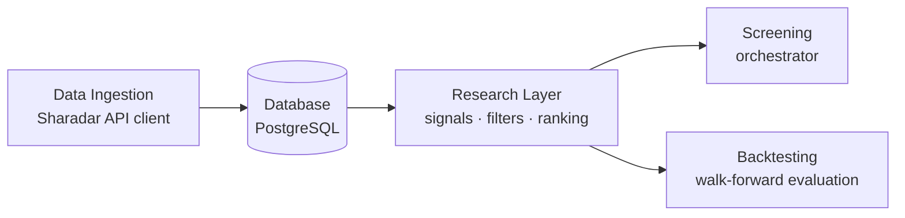

# Sharadar Toolkit

A point-in-time equity research and screening toolkit built on Nasdaq Data Link's Sharadar datasets.

## Architecture

```mermaid
flowchart LR
    A["Data Ingestion<br/>Sharadar API client"] --> B[("Database<br/>PostgreSQL")]
    B --> C["Research Layer<br/>signals · filters · ranking"]
    C --> D["Screening<br/>orchestrator"]
    C --> E["Backtesting<br/>walk-forward evaluation"]
```
